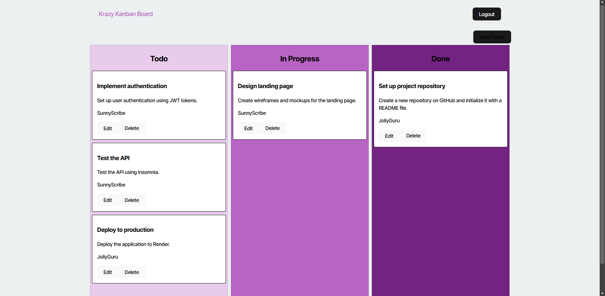

# Kanban Board Application

A Kanban board application designed to manage tasks effectively, built using **React** for the front-end and **Express** for the back-end. The project runs both the client and server separately, with clear instructions provided to set up and run the application.


## Table of Contents

- [Prerequisites](#prerequisites)
- [Installation](#installation)
- [Running the Application](#running-the-application)
  - [Development Mode](#development-mode)
  - [Production Mode](#production-mode)
- [Contributing](#contributing)
- [License](#license)

## Prerequisites

Before running the project, ensure you have the following software installed on your system:

- [Node.js](https://nodejs.org/en/) (v14 or higher)
- [npm](https://www.npmjs.com/) (v6 or higher)
- [PostgreSQL](https://www.postgresql.org/) (if using PostgreSQL for the database)

## Installation

Follow these steps to clone the repository and install dependencies for both the client and server:

1. Clone the repository to your local machine:
    ```bash
    git clone git@github.com:hieu12-12/kanban-board.git
    ```

2. Navigate into the project directory:
    ```bash
    cd kanban-board
    ```

3. Install dependencies for both the client and the server:
    ```bash
    npm run install
    ```

This command will run `npm install` inside both the client and server directories, setting up all necessary dependencies.

## Running the Application
Create `.env` file (Take a look at `.env.EXAMPLE`)

### Development Mode

To start the development environment and run both the client and server simultaneously, use the following command:

```bash
npm run start:dev



License
This project is licensed under the MIT License - see the LICENSE file for details.
